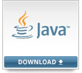

# BigData Science Practical Training Course

Python For BigData @ <a href='https://www.facebook.com/jskim.kr'>FB / jskim.kr</a>, [김진수](bigpycraft@gmail.com)

 

## SBA 2019, Seoul Business Agency Innovation Growth Intensive Training

## Notice 
* [Homesite] : http://www.seoulit.or.kr/main/main.html
* [Sharings] : https://github.com/bigpycraft/sba19-seoulit
* [Password] : bigpycraft19

## Innovation Growth Intensive Training
- Python Programming Basics
- Python Packages and Modules
- Data Processing and Analysis
- Web Cralwling
- Natural Language Processing
- Machine Learning
- Deep Learning

## Python Develop Environment

<h3> Python </h3>

<table align="left">
    <tr align="left">
        <td width="200">
            
        </td>
        <td width="800">

<b> Latest: Python 3.7.4</b>
  
- Download : https://www.python.org/downloads/windows/
 
- Download the latest version 
 
- Check the OS version & bit (32bit / 64bit)

</td>
    </tr>
</table>
 

<h3> PyCharm </h3>

<table align="left">
    <tr align="left">
        <td width="200">
            
        </td>
        <td width="800">

<b> Latest : Python 3.7 version | Release Date: July 24, 2019</b>
  
- Download : https://www.jetbrains.com/pycharm/download/
 
- Version: 2019.2
 
- Build: 192.5728.105
 
- July 24, 2019
 
- Download Community Version 

</td>
    </tr>
</table>
 

<h3> Jupyter Notebook </h3>

<table align="left">
    <tr align="left">
        <td width="200">
            
        </td>
        <td width="800">

<b> Latest : Version 2019.07 | Release Date: July 25, 2019 </b>
 
- Python 3.7 version
 
- Filename : Anaconda3-2019.07-Windows-x86_64.exe
 
- Download : https://www.anaconda.com/distribution/
 
- Check the OS version & bit (32bit / 64bit)

 

<b> Recommand Previous: Version 5.2 | Release Date: May 30, 2018 </b>
 
- Filename : Anaconda3-5.2.0-Windows-x86_64.exe
 
- Download : https://repo.continuum.io/archive/ 
 
- Reason : TF Requires Python 3.4, 3.5, or 3.6 
 
- TensorFlow : https://www.tensorflow.org/install/pip

</td>
    </tr>
</table>
 

### Selenium WebDriver 

<table align="left">
    <tr align="left">
        <td width="200">
            
        </td>
        <td width="800">

    <b> - Selenium HQ </b> : https://www.seleniumhq.org/projects/webdriver/
       - 아래 사이트에서 OS에 맞는 웹드라이브를 다운받아 압축을 풀어 driver 폴더에 복사
      
    <b> 1. Chrome WebDriver </b> &nbsp;&nbsp; : <a href='http://chromedriver.chromium.org/downloads'>[다운로드1]</a>, &nbsp;&nbsp;&nbsp;<a href='https://sites.google.com/a/chromium.org/chromedriver/downloads'>[다운로드2]</a>
      
    <b> 2. Firefox WebDriver </b> &nbsp;&nbsp;&nbsp;&nbsp; : <a href='https://github.com/mozilla/geckodriver/releases'>[다운로드]</a>
      
    <b> 3. Microsoft WebDriver </b> : <a href='https://developer.microsoft.com/en-us/microsoft-edge/tools/webdriver/'>[다운로드]</a>
      
    <b> cf. 가장 보편적으로 많이 사용하는 크롬 웹드라이브를 다운받아서 설치한다. </b>

        </td>
    </tr>
</table>
 

### Selenium 1.0 + WebDriver = Selenium 2.0
- HomeSite : https://www.seleniumhq.org/projects/webdriver/
- WebDriver is designed in a simpler and more concise programming interface along with addressing some limitations in the Selenium-RC API.
- WebDriver is a compact Object Oriented API when compared to Selenium1.0
- It drives the browser much more effectively and overcomes the limitations of Selenium 1.x which affected our functional test coverage, like the file upload or download, pop-ups and dialogs barrier
- WebDriver overcomes the limitation of Selenium RC's Single Host origin policy

 

### KoNLPy Install Guide  

<table align="left">
    <tr align="left">
        <td width="200">
            
        </td>
        <td width="800">

    <b> 1. JAVA 환경 </b> : <a href="https://www.oracle.com/technetwork/java/javase/downloads/">JDK (>=1.8)</a> Install & JAVA Environmnmet Variable Setting
      
    <b> 2. MS Visual C++ 설치 </b> : <a href="https://www.scivision.co/python-windows-visual-c++-14-required/">Build Tools for Visual Studio 2017 (>=14.0) </a> Install 
      
    <b> 3. JPype 설치 </b> : <a href="https://www.lfd.uci.edu/~gohlke/pythonlibs/#jpype">JPype1  (>=0.5.7) </a>Install
      &nbsp;&nbsp; (Anaconda Prompt) C:\Users\user> <b> pip install --upgrade pip </b>
      &nbsp;&nbsp; (Anaconda Prompt) C:\Users\user> <b> pip install JPype1‑0.6.3‑cp36‑cp36m‑win_amd64.whl </b>
      
    <b> 4. KoNLPy 설치 </b> :
      &nbsp;&nbsp; (Anaconda Prompt) C:\Users\user> <b> pip install konlpy </b>

        </td>
    </tr>
</table>
 

### JDK Install & JAVA Environment Setting

<table align="left">
    <tr align="left">
        <td width="200">
            
        </td>
        <td width="800">

 
    <b> - Download </b> : https://www.oracle.com/technetwork/java/javase/downloads/
       
    <b> - 시스템 환경변수 </b>
       
    <b> 1. JAVA_HOME </b> = C:\Java\jdk1.8.0
       
    <b> 2. Path </b> = %Path%; %JAVA_HOME%\bin
      
    <b> 3. CLASSPATH </b> = .; %JAVA_HOME%\lib;

        </td>
    </tr>
</table>

### TensorFlow

<table align="left">
    <tr align="left">
        <td width="200">
            
        </td>
        <td width="800">

    <b> - TensorFlow.org </b> : https://www.tensorflow.org/
       - An open source machine learning library for research and production.
      
    <b> 1. TenforFlow Install  : <a href='https://www.tensorflow.org/install/'>[설치가이드]</a>
      
    <b> 2. TenforFlow Develop : <a href='https://www.tensorflow.org/tutorials/'>[튜토리얼]</a>
      
    <b> 3. TensorFlow Community </b> : <a href='https://www.tensorflow.org/community/'>[커뮤니티]</a>
      
    <b> cf. Environment : Install a Python 3.6.x or Python 3.7.x 64-bit release for Windows </b>

        </td>
    </tr>
</table>
 

### Microsoft Azuer Notebooks

<table align="left">
    <tr align="left">
        <td width="200">
            
        </td>
        <td width="800">

- <b> Microsoft Azure Notebooks </b> : https://notebooks.azure.com/
  
- Interactive coding in my browser
  
- Free, in the cloud, powered by jupyter

</td>
    </tr>
</table>
 

<marquee>The BigpyCraft find the information to design valuable society with Technology & Craft.</marquee>

 &lt; The End &gt; 

