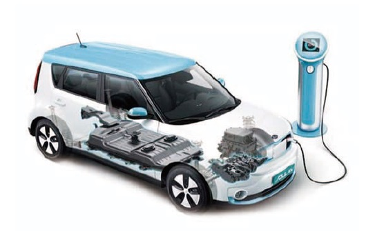
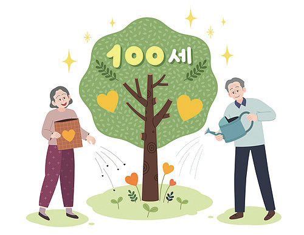
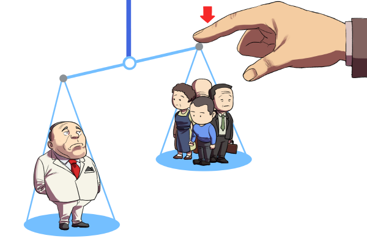

# BigData Science Practical Training Course

Python For BigData @ <a href='https://www.facebook.com/jskim.kr'>FB / jskim.kr</a>, [김진수](bigpycraft@gmail.com)

<h2><b>Team Project in BigData Science Cource</b></h2>

## Notice for Team Project
>  
- Team Building : 2019.09.09(월) 3:00pm
- 착수보고 발표 : 2019.09.10(화) 4:00pm    
- 결과보고 취합 : 2019.09.18(수)  
- 최종보고 발표 : 2019.09.19(목) 1:00pm    cf. 발표10분,질문5분
  ※ 유튜버 대도서관님 특강 : 2019.09.19(목) 3:00pm~5:00pm 

## Reference Documents

- Proj-01. [착수보고서 포맷           ][proj-01]
- Proj-02. [문제정의서 포맷           ][proj-02]
- Proj-03. [프로젝트 주제선정         ][proj-03]

[proj-01]:  ./docu/SBA19_착수보고서_포맷_OOO팀.docx             "Go proj-01"
[proj-02]:  ./docu/SBA19_문제정의서_포맷.pdf                    "Go proj-02"
[proj-03]:  ./docu/SBA19_관심주제발표_For_Team_Building.pdf     "Go proj-03"

##  Team Project : Kick Off

- 1st Subject : <b>Analyze Social Issues Using BigData </b>
- Our Motto   : <b>Learning by doing, doing by learning !! </b>
- Report Format : <a href="./docu/SBA19_착수보고서_포맷_OOO팀.docx">착수보고서 양식</a>
- ※ If you click on the image on the right, you can view "Initiation Report" by team.

<table border=1 bgcolor="#EEEEEE">
	<tr bgcolor="#CC0000">
		<td width="100">
<b>Team Name        </b>
</td>
		<td width="100">
<b>Team Building    </b>
</td>
		<td width="300">
<b>Project Subject  </b>
</td>
		<td width="120">
<b>Reports          </b>
</td>
	</tr>
	<tr>
		<td>
 A팀  <b>EV짜요</b>                                                                                          
</td>
		<td>
 윤종필, 홍성민  이찬희, 구교석                                                                              
</td>
		<td>
 전기차 보급확대 및 이용자의 편의 증대를 위한 방안마련 – 전기충전소를 중심으로 	                                 
</td>
		<td>
     
</td>
	</tr>
	<tr>
		<td>
 B팀  <b>Fros팀</b>                                                                                          
</td>
		<td>
 김태웅, 백서연  김봉수                                                                                      
</td>
		<td>
 유기견 현황 조사 및 분석                                                                                        
</td>
		<td>
     
</td>
	</tr>
	<tr>
		<td>
 C팀  <b>강산이네</b>                                                                                         
</td>
		<td>
 이강산, 이송현  김은수                                                                                       
</td>
		<td>
 100세 시대의 문제해결방향                                                                                        
</td>
		<td>
     
</td>
	</tr>
	<tr>
		<td>
 D팀  <b>고공비행</b>                                                                                         
</td>
		<td>
 권다연, 김은비  김태인                                                                                       
</td>
		<td>
 서울시 골목상권 활성화 및 외국인 관광객 만족도 개선을 위한 방안모색                                              
</td>
		<td>
    
</td>
	</tr>
	<tr>
		<td>
 E팀  <b>No Japan</b>                                                                                         
</td>
		<td>
 김슬기, 성형민  김지은                                                                                       
</td>
		<td>
 일본 불매운동에 대한 과거와 현재의 온도 차                                                                       
</td>
		<td>
    
</td>
	</tr>
	<tr>
		<td>
 F팀  <b>이구아나</b>                                                                                         
</td>
		<td>
 김재경, 김수환	  이승은, 신은영                                                                              
</td>
		<td>
 서울 vs 지방, 의료 양극화 보완	                                                                                  
</td>
		<td>
      
</td>
	</tr>
	<tr>
		<td>
 G팀  <b>취미요? 파이썬이요</b>                                                                           
</td>
		<td>
 류경아, 손하늘	  양한솔                                                                                      
</td>
		<td>
 지역 인프라 분석으로 인프라 발전 방안 모색	                                                                      
</td>
		<td>
  
</td>
	</tr>
</table>

<marquee>The BigpyCraft find the information to design valuable society with Technology & Craft.</marquee>

 &lt; The End &gt; 

